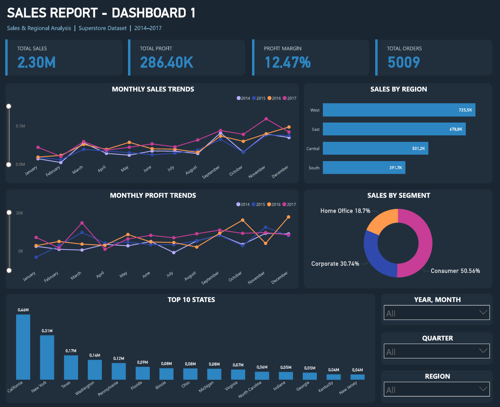
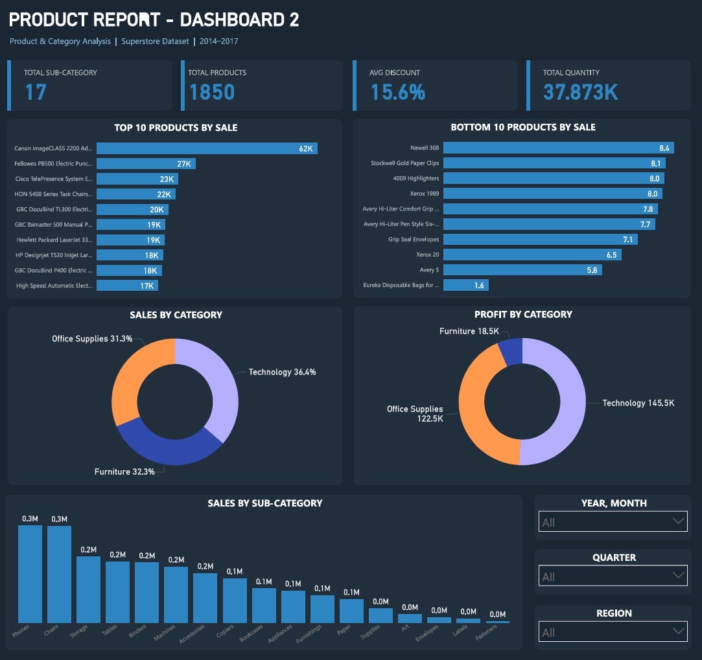

# 📊 Superstore Sales & Product Dashboard
Built with Power BI | 2014–2017 Data | US Retail

---

## 📌 Project Overview
A 2-page interactive Power BI dashboard analyzing $2.3M in sales across 4 years for a US retail chain covering 3 regions, 3 categories and 17 sub-categories.

---

## 📁 Dashboard Pages

**Dashboard 1 — Sales & Regional Analysis**
| Metric | Value |
|---|---|
| Total Sales | $2.30M |
| Total Profit | $286.40K |
| Profit Margin | 12.47% |
| Total Orders | 5,009 |

**Dashboard 2 — Product & Category Analysis**
| Metric | Value |
|---|---|
| Total Unique Products | 1,850 |
| Total Quantity Sold | 37,873 |
| Avg Discount | 15.6% |
| Total Sub-Categories | 17 |

---

## 🔍 Key Business Insights

| Insight | Finding |
|---|---|
| Top State | California — $0.46M |
| Weakest Region | Central — loss-making |
| Best Category | Technology — $145K profit |
| Problem Area | Furniture — 32% of sales, lowest profit |
| Discount Impact | High discounts directly reducing margins |

---

## 🛠️ Tools Used
- Power BI Desktop
- DAX (Calculated Measures)
- Data Modeling
- Power Query

---

## 📂 Dataset
- Source: [Kaggle — Superstore Dataset](https://www.kaggle.com/datasets/vivek468/superstore-dataset-final)
- Size: 9,994 rows | 21 columns

---

## 📸 Dashboard Preview

**Dashboard 1 — Sales & Regional**

**Dashboard 2 — Product Analysis**

---

## 🚀 How to Use
1. Download `SUPERSTORE DASHBOARD.pbix` and open in Power BI Desktop
2. Use **slicers** to filter by Year / Region / Category
3. Click any visual to **cross-filter** the entire dashboard
